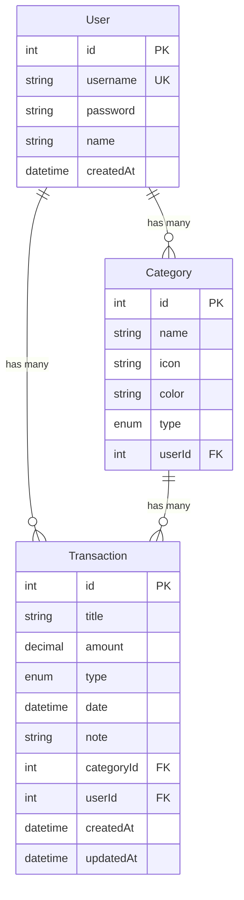

# 📖 คู่มือการใช้งาน Expense Tracker — ครบทุกฟีเจอร์

## สถาปัตยกรรมโดยรวม

| ส่วน | เทคโนโลยี |
|---|---|
| **Backend** | Elysia (Bun) + Prisma ORM + PostgreSQL |
| **Frontend** | Next.js (React) + TailwindCSS + Recharts |
| **Database** | PostgreSQL 15 (Docker) |
| **Authentication** | JWT (7 วัน) + bcryptjs |

---

## 1. 🔐 ระบบสมัครสมาชิก (Register)

**เส้นทาง:** `/register`

### วิธีใช้งาน
1. เปิดเว็บแอป → ระบบจะ redirect ไปหน้า Login อัตโนมัติ (ถ้ายังไม่ได้ Login)
2. คลิกลิงก์ **"สมัครสมาชิก"** ที่ด้านล่างของหน้า Login
3. กรอกข้อมูล:
   - **ชื่อ-นามสกุล** — ต้องมีอย่างน้อย 2 ตัวอักษร
   - **ชื่อผู้ใช้ (username)** — ต้องมีอย่างน้อย 3 ตัวอักษร, ไม่ซ้ำกับผู้ใช้คนอื่น
   - **รหัสผ่าน** — ต้องมีอย่างน้อย 6 ตัวอักษร (ระบบจะ hash ด้วย bcryptjs ก่อนเก็บ)
4. กดปุ่ม **"สมัครสมาชิก"**
5. สมัครสำเร็จ → ระบบจะ redirect ไปหน้า Login พร้อมแจ้ง Toast "สมัครสมาชิกสำเร็จ! 🎉"

> [!NOTE]
> ระบบมี **Field-level validation** แบบ real-time — แสดงข้อผิดพลาดทันทีเมื่อ blur ออกจากช่อง

---

## 2. 🔑 ระบบเข้าสู่ระบบ (Login)

**เส้นทาง:** `/login`

### วิธีใช้งาน
1. กรอก **ชื่อผู้ใช้** และ **รหัสผ่าน**
2. กดปุ่ม **"เข้าสู่ระบบ"**
3. Login สำเร็จ → ระบบเก็บ JWT Token ลง `localStorage` แล้ว redirect ไปหน้า Dashboard
4. ถ้ากรอกผิด → แสดงข้อผิดพลาด "Username หรือรหัสไม่ถูกต้อง"

> [!IMPORTANT]
> Token มีอายุ **7 วัน** หลังหมดอายุจะต้อง Login ใหม่

---

## 3. 📊 หน้า Dashboard

**เส้นทาง:** `/dashboard`

หน้าแรกหลัง Login — แสดงภาพรวมทางการเงินทั้งหมด

### 3.1 Summary Cards (การ์ดสรุป)

แสดง 3 การ์ดหลัก:

| การ์ด | ความหมาย | สี |
|---|---|---|
| **รายรับ** | ยอดรวมรายรับทั้งหมด (ตาม filter) | 🟢 เขียว |
| **รายจ่าย** | ยอดรวมรายจ่ายทั้งหมด (ตาม filter) | 🔴 แดง |
| **ยอดคงเหลือ** | รายรับ − รายจ่าย | สีเขียวถ้าบวก, แดงถ้าติดลบ |

### 3.2 ตัวกรองข้อมูล (Filters)

ส่วนกรองอยู่ด้านบนของหน้า มีตัวเลือก:

- **วันเริ่มต้น / วันสิ้นสุด** — เลือกจาก DatePicker (ปฏิทินภาษาไทย)
- **หมวดหมู่** — เลือกจาก dropdown (ทั้งหมด / หมวดหมู่เฉพาะ)
- ปุ่ม **"กรอง"** — กดเพื่อ apply filter
- ปุ่ม **"ล้าง"** — กดเพื่อ reset filter กลับเป็นค่าเริ่มต้น

### 3.3 Pie Chart (แผนภูมิวงกลม)

- แสดง **สัดส่วนรายจ่ายหรือรายรับ** แยกตามหมวดหมู่
- สลับดูได้ระหว่าง **"รายจ่าย"** และ **"รายรับ"** ด้วยปุ่ม toggle
- ตรงกลาง Donut Chart แสดง **ยอดรวม** ของประเภทที่เลือก
- Hover ที่แต่ละส่วนจะแสดง Tooltip บอกชื่อหมวดหมู่และจำนวนเงิน
- มี Legend แสดงชื่อหมวดหมู่ด้านล่าง

### 3.4 รายการล่าสุด

- แสดง **5 รายการล่าสุด** (เรียงจากใหม่ → เก่า)
- แต่ละรายการแสดง: ชื่อ, หมวดหมู่, วันที่, จำนวนเงิน, icon ลูกศร (เขียว = รายรับ, แดง = รายจ่าย)
- มีปุ่ม **"ส่งออก"** สำหรับ export เป็น CSV หรือ Excel
- มีลิงก์ **"ดูทั้งหมด →"** เพื่อไปหน้ารายการทั้งหมด

### 3.5 ปุ่มเพิ่มรายการ

- ปุ่ม **"+ เพิ่มรายการ"** อยู่มุมขวาบน → เปิด Modal สำหรับเพิ่มรายการใหม่

---

## 4. 📋 หน้ารายการทั้งหมด (Transactions)

**เส้นทาง:** `/transactions`

แสดงรายการธุรกรรมทั้งหมดของผู้ใช้ พร้อมเครื่องมือจัดการ

### 4.1 ตัวกรอง

- **วันเริ่มต้น / วันสิ้นสุด** — DatePicker ภาษาไทย
- **ประเภท** — dropdown เลือก: ทั้งหมด / รายรับ / รายจ่าย
- ปุ่ม **"กรอง"** / **"ล้าง"**

### 4.2 การจัดเรียง (Sort)

- ปุ่ม **"วันที่"** — จัดเรียงตามวันที่ (กดซ้ำเพื่อสลับ ↑↓)
- ปุ่ม **"จำนวนเงิน"** — จัดเรียงตามจำนวนเงิน (กดซ้ำเพื่อสลับ ↑↓)
- มีไอคอนลูกศรแสดงทิศทาง

### 4.3 รายการธุรกรรม

แต่ละรายการแสดง:
- **ไอคอน** — ลูกศรขึ้น (เขียว) สำหรับรายรับ, ลูกศรลง (แดง) สำหรับรายจ่าย
- **ชื่อรายการ** — ชื่อที่ตั้งเมื่อบันทึก
- **Badge ประเภท** — แท็ก "รายรับ" หรือ "รายจ่าย"
- **หมวดหมู่**  — ชื่อหมวดหมู่
- **วันที่** — แสดงในรูปแบบไทย
- **หมายเหตุ** — แสดง 1 บรรทัด (ถ้ามี) พร้อม 📝
- **จำนวนเงิน** — แสดงที่ด้านขวา (+/−฿)
- **ไอคอนแก้ไข** — จะปรากฏเมื่อ hover (ปากกา ✏️)

### 4.4 คลิกแก้ไขรายการ

- **คลิกที่รายการใดก็ได้** → เปิด Modal แก้ไข (ดูรายละเอียดใน Section 5)

### 4.5 ส่งออกข้อมูล (Export)

- กดปุ่ม **"ส่งออก"** → เลือก **CSV** หรือ **Excel**
- ข้อมูลที่ export จะรวมถึง: ชื่อรายการ, ประเภท, หมวดหมู่, จำนวนเงิน, วันที่, หมายเหตุ
- ไฟล์ชื่อ `รายการค่าใช้จ่าย_YYYY-MM-DD.csv` หรือ `.xls`

> [!TIP]
> Export จะส่งออกตาม **filter + sort** ที่เลือกอยู่ — ถ้าต้องการ export ทั้งหมดให้กด "ล้าง" ก่อน

---

## 5. ➕ Modal เพิ่ม/แก้ไข/ลบ รายการ (TransactionModal)

Modal ที่ใช้สร้าง แก้ไข และลบรายการ — เปิดได้จากทั้งหน้า Dashboard และ Transactions

### 5.1 เพิ่มรายการใหม่

1. กดปุ่ม **"+ เพิ่มรายการ"**
2. กรอกข้อมูล:

| ฟิลด์ | คำอธิบาย | บังคับ? |
|---|---|---|
| **ชื่อรายการ** | เช่น "ค่าอาหารกลางวัน" (ไม่เกิน 100 ตัวอักษร) | ✅ |
| **จำนวนเงิน (฿)** | จำนวนเงิน ≥ 1 บาท (รองรับทศนิยม 2 ตำแหน่ง) | ✅ |
| **ประเภท** | เลือก **รายจ่าย** หรือ **รายรับ** (ค่าเริ่มต้น: รายจ่าย) | ✅ |
| **หมวดหมู่** | เลือกจากรายการที่เคยสร้าง หรือ **พิมพ์ชื่อใหม่** เพื่อสร้างหมวดหมู่ใหม่อัตโนมัติ | ✅ |
| **วันที่** | เลือกจากปฏิทิน (ค่าเริ่มต้น: วันนี้) | ✅ |
| **หมายเหตุ** | รายละเอียดเพิ่มเติม | ❌ |

3. กดปุ่ม **"เพิ่มรายการ"** → แจ้ง Toast "เพิ่มรายการสำเร็จ! 🎉"

### 5.2 แก้ไขรายการ

1. **คลิกที่รายการ** ในหน้า Transactions → Modal เปิดพร้อมข้อมูลเดิม
2. แก้ไขข้อมูลตามต้องการ
3. กดปุ่ม **"บันทึกการแก้ไข"** → แจ้ง Toast "แก้ไขรายการสำเร็จ! ✏️"

### 5.3 ลบรายการ

1. เปิด Modal แก้ไขรายการ (คลิกที่รายการ)
2. กดปุ่ม **🗑️ (ถังขยะ)** ที่มุมซ้ายล่าง
3. ระบบจะถาม **confirm** ว่าแน่ใจหรือไม่
4. ยืนยัน → ลบรายการ + แจ้ง Toast "ลบรายการสำเร็จ! 🗑️"

> [!CAUTION]
> การลบรายการ **ไม่สามารถย้อนกลับได้!**

### 5.4 ระบบหมวดหมู่อัจฉริยะ

- เมื่อพิมพ์ในช่องหมวดหมู่ ระบบจะ **แนะนำหมวดหมู่** ที่เคยสร้างไว้ (filter ตามตัวอักษรที่พิมพ์)
- คลิกเลือกจาก dropdown ได้ทันที
- ถ้าพิมพ์ชื่อที่ยังไม่เคยมี → ระบบจะ **สร้างหมวดหมู่ใหม่อัตโนมัติ** เมื่อบันทึกรายการ
- หมวดหมู่แต่ละอันจะผูกกับประเภท (รายรับ / รายจ่าย) และ **ผูกกับ user** แต่ละคน (user สร้างหมวดใครหมวดมัน)

---

## 6. 🧭 แถบนำทาง (Navbar)

แถบนำทางอยู่ด้านบนสุด (fixed) มีเมนู:

| เมนู | หน้าที่ |
|---|---|
| **Expense Tracker** (โลโก้) | แสดงชื่อแอป |
| **แดชบอร์ด** | ไปหน้า Dashboard |
| **รายการ** | ไปหน้ารายการทั้งหมด |
| **ออกจากระบบ** | ลบ token + redirect ไปหน้า Login |

> [!NOTE]
> บนมือถือ ข้อความเมนูจะซ่อน — แสดงเฉพาะไอคอน

---

## 7. 🔔 ระบบแจ้งเตือน (Toast)

ระบบแจ้งเตือนแบบ pop-up ปรากฏมุมขวาบน มี 4 ประเภท:

| ประเภท | สี | ใช้เมื่อ |
|---|---|---|
| ✅ **success** | เขียว | ทำงานสำเร็จ (เพิ่ม/แก้ไข/ลบ/login/export) |
| ❌ **error** | แดง | เกิดข้อผิดพลาด |
| ⚠️ **warning** | เหลืองอำพัน | เตือน เช่น ไม่มีข้อมูลให้ export |
| ℹ️ **info** | ฟ้า | แจ้งข้อมูลทั่วไป |

- Toast จะ **หายไปอัตโนมัติ** หลัง 3 วินาที
- มี **progress bar** แสดงเวลาที่เหลือ
- กดปุ่ม **✕** เพื่อปิดก่อนเวลา

---

## 8. 🔒 ระบบรักษาความปลอดภัย

- ทุก API endpoint (ยกเว้น Login/Register) ต้องส่ง **JWT Token** ใน header `Authorization: Bearer <token>`
- หน้า Dashboard และ Transactions จะ **redirect ไปหน้า Login** อัตโนมัติถ้าไม่ได้ login
- รหัสผ่านถูก **hash ด้วย bcryptjs** (salt rounds: 10) ก่อนเก็บลง database
- หน้า Home (`/`) จะ redirect อัตโนมัติ → Dashboard (ถ้า login อยู่) หรือ Login (ถ้ายังไม่ login)

---

## 9. 🐳 การตั้งค่าและรันโปรเจกต์

### ขั้นตอนที่ 1: เตรียม Database (Docker)
```bash
# ที่ root ของโปรเจกต์ (มีไฟล์ docker-compose.yaml)
docker-compose up -d
```
ระบบจะสร้าง PostgreSQL container ชื่อ `money-tracker-db` บน port `5433`

### ขั้นตอนที่ 2: Backend
```bash
cd backend
bun install              # ติดตั้ง dependencies
npx prisma migrate dev   # สร้างตาราง database
bun run dev              # รัน backend ที่ port 3001
```

### ขั้นตอนที่ 3: Frontend
```bash
cd frontend
npm install              # ติดตั้ง dependencies
npm run dev              # รัน frontend ที่ port 3000 (default)
```

### ตัวแปร Environment

**Backend** (`backend/.env`) — ต้องมี:
- `DATABASE_URL` — connection string ของ PostgreSQL
- `JWT_SECRET` — secret key สำหรับ JWT

**Frontend** (`frontend/.env`) — ต้องมี:
- `NEXT_PUBLIC_BACKEND_URL` — URL ของ backend เช่น `http://localhost:3001`

---

## 10. 📐 โครงสร้างฐานข้อมูล



---

## สรุปฟีเจอร์ทั้งหมด

| # | ฟีเจอร์ | หน้า |
|---|---|---|
| 1 | สมัครสมาชิก (พร้อม validation) | `/register` |
| 2 | เข้าสู่ระบบ (JWT Authentication) | `/login` |
| 3 | ออกจากระบบ | Navbar |
| 4 | Auto-redirect ตามสถานะ login | `/` |
| 5 | Dashboard สรุปรายรับ/รายจ่าย/ยอดคงเหลือ | `/dashboard` |
| 6 | Pie Chart สัดส่วนตามหมวดหมู่ | `/dashboard` |
| 7 | สลับดู Pie Chart ระหว่างรายรับ/รายจ่าย | `/dashboard` |
| 8 | กรองข้อมูลตามวันที่ + หมวดหมู่ | `/dashboard`, `/transactions` |
| 9 | รายการล่าสุด 5 รายการ | `/dashboard` |
| 10 | เพิ่มรายการ (รายรับ/รายจ่าย) | Modal |
| 11 | แก้ไขรายการ | Modal |
| 12 | ลบรายการ (พร้อม confirm) | Modal |
| 13 | หมวดหมู่อัจฉริยะ (auto-suggest + สร้างใหม่อัตโนมัติ) | Modal |
| 14 | ดูรายการทั้งหมด | `/transactions` |
| 15 | กรองตามประเภท (รายรับ/รายจ่าย) | `/transactions` |
| 16 | จัดเรียงตามวันที่ / จำนวนเงิน (↑↓) | `/transactions` |
| 17 | ส่งออก CSV | `/dashboard`, `/transactions` |
| 18 | ส่งออก Excel | `/dashboard`, `/transactions` |
| 19 | Toast แจ้งเตือน (4 ประเภท) | ทุกหน้า |
| 20 | Responsive Design (รองรับมือถือ) | ทุกหน้า |
